**Nama : Rahmat**
**Kelas : TI.20.A.2**

# Lab6Web

## Membuat web dengan menggunakan Bootstrap

### Menggunakan Bootstrap

Untuk menggunakan bootstrap bisa dengan cara online dan offline. Namun pada projek kali ini saya menggunakan bootstrap secara offline.

Pertama download dahulu file bootstrap dari web resminya, kemudian simpan di tempat yang ingin di tempatkan projek dan ekstrak file yang sudah di donwload. Setelah di ekstrak, ada dua file yaitu file CSS dan file JS. Seperti contohnya saya menyimpan di folder Lab6Web.

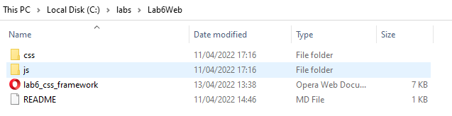

Kemudian buat file html dengan nama lab6_css_framework.html pada bagian tag `<body>` sisipkan tag `<link>` dan hrefnya di isi dengan nama file yang ada di dalam folder CSS seperti gambar dibawah.

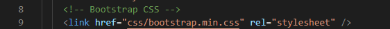

### Membuat header

Pertama buat tag `
` dengan class container agar tampilan sisi web tidak memenuhi seluruh layar. Selanjutnya gunakan tag `<header>` seperti dibawah.

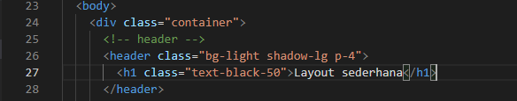

Ini tampilannya dibrowser.

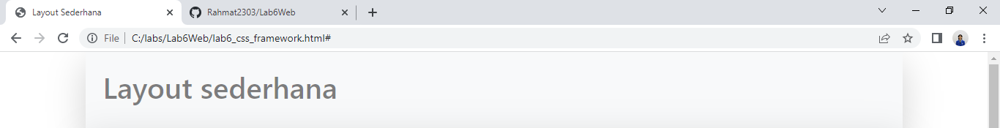

### Membuat navigasi

Untuk membuat navigasi gunakan tag `<nav>` seperti dibawah ini.

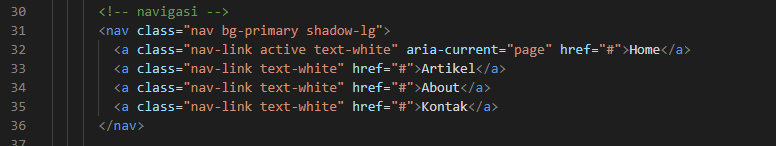

Ini tampilannya dibrowser.

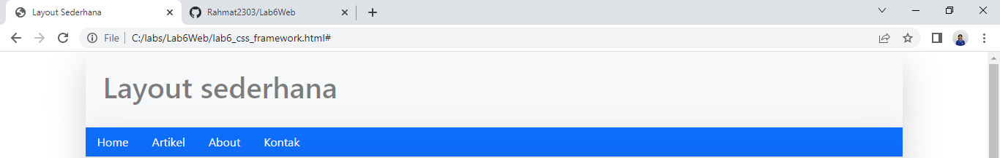

Untuk menambahkan hover, saya menggunakan css yang di simpan di bagian tag `<head>`. Seperti gambar dibawah.

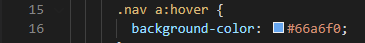

### Membuat hero

Pertama saya buat tag `
` dengan class shadow-lg agar di sisi web muncul shadow. Dan kodingan untuk membuat hero seperti dibawah.

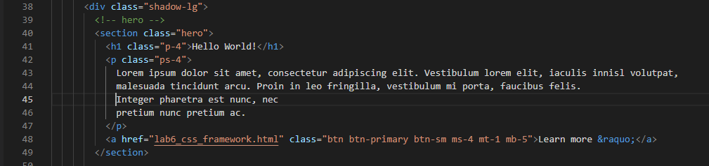

Ini tampilannya dibrowser.

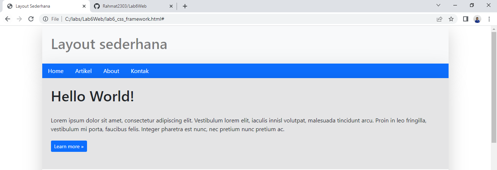

Untuk backgroundnya saya pisah dan dibuat di css seperti dibawah.

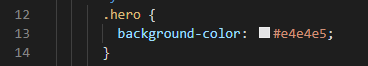

### Membuat wrapper

Di dalam wrapper ada main dan sidebar.

1. Untuk membuat bagian main, kodingannya sebagai berikut.

Ini bagian row.

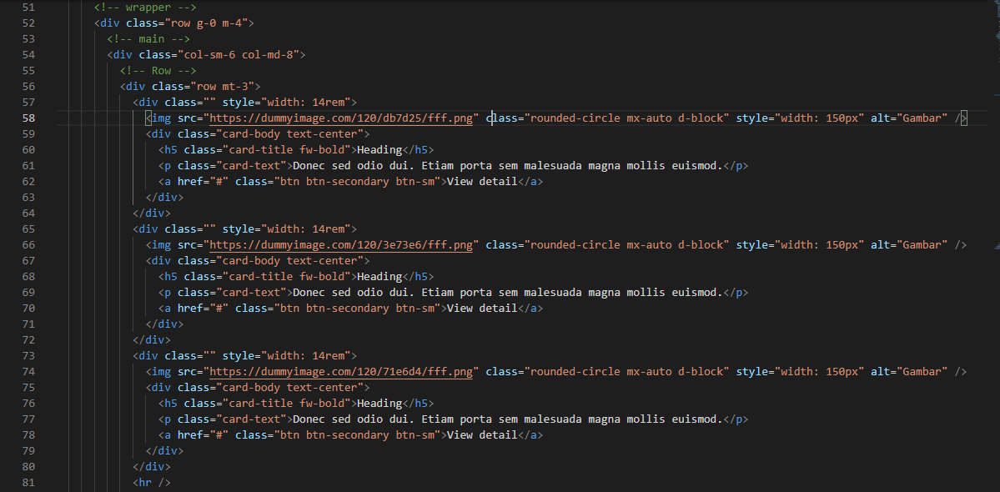

Ini tampilannya dibrowser.

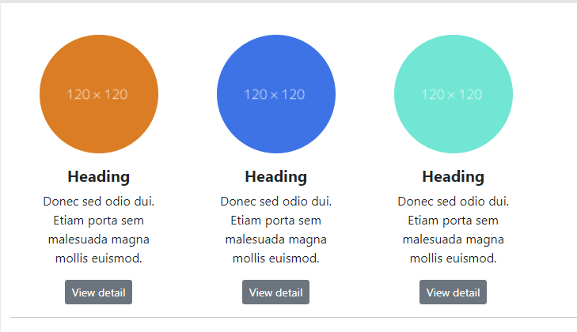

Ini bagian entry.

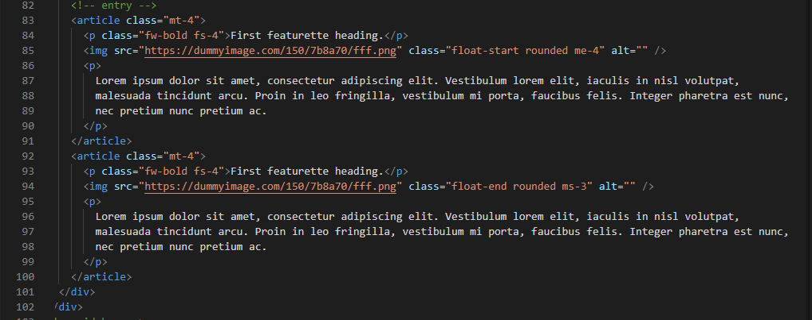

Ini tampilannya dibrowser.

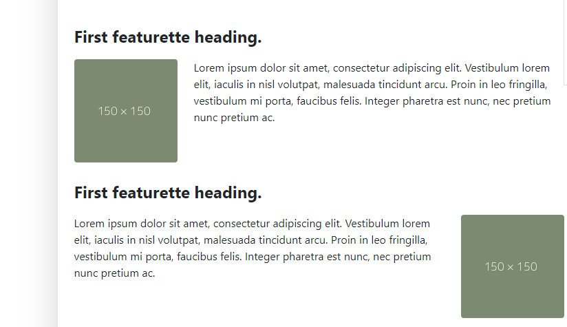

2. Untuk membuat bagian sidebar, kodingannya sebagai berikut.

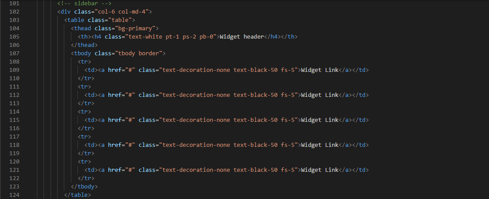

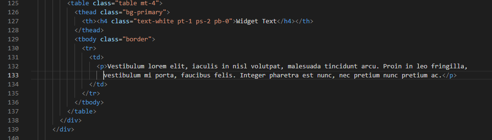

Ini tampilannya dibrowser.

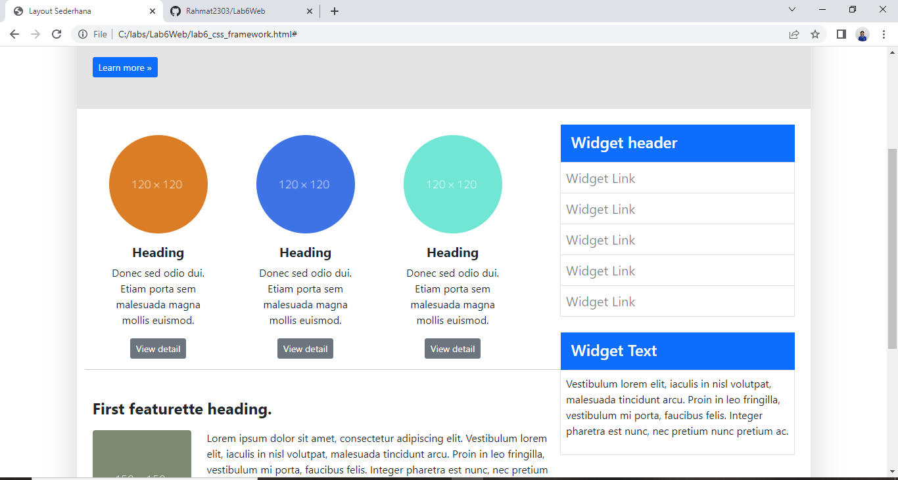

Untuk hovernya saya simpan di css seperti berikut.

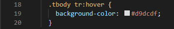

### Membuat footer

Untuk membuat footer kodingannya seperti berikut.

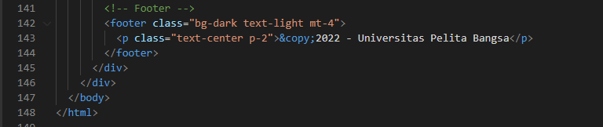

Ini tampilannya dibrowser.

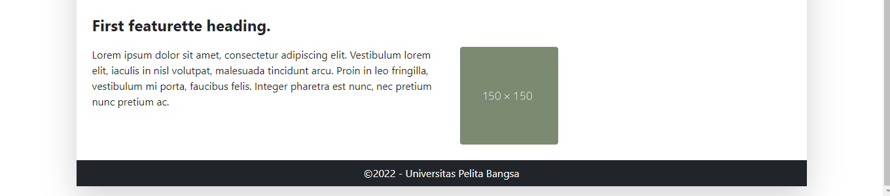

### Tamplian website secara penuh

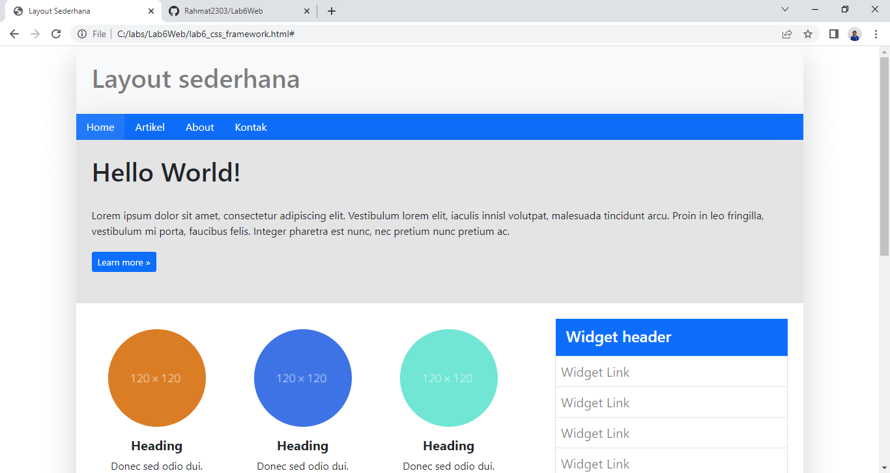
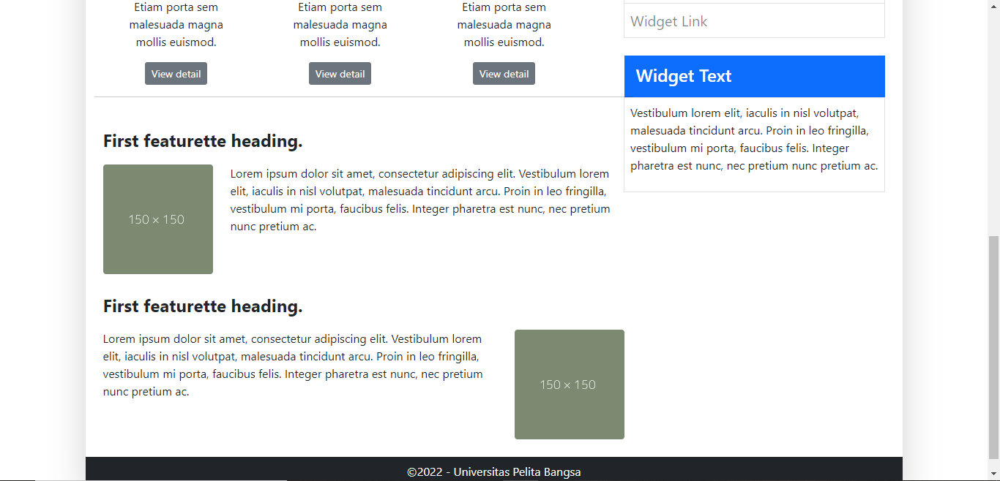
